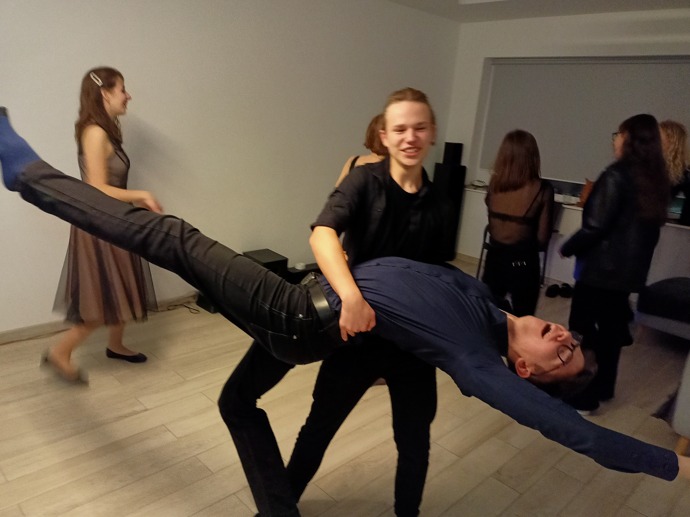

# Plany na piątek {#2} [1^]

| header | header | header |
| :----: | :----: | :----: |
| text   |  text  |    text    |
|   text   |   text   |   text   |

`print("Hello World")` 

- robienie bardzo śmiesznych rzeczy
- bycie grzecznym
- stosowanie się przepisów ruchu drogowego

## Link do google [2^]
[Google](https://google.com).

[1](#2)

[^1]:Tak wygląda mój piątek

[^2]:A tu znajdziesz odpowiedzi na wszystkie pytania :)
